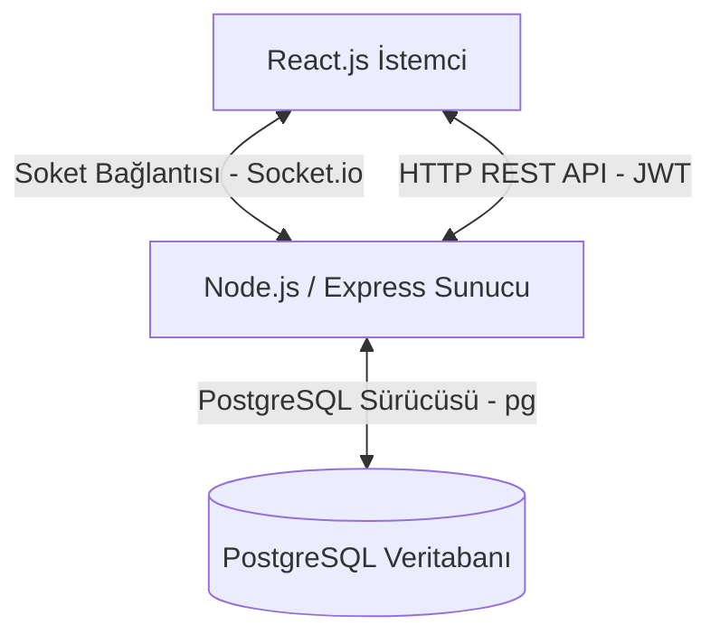
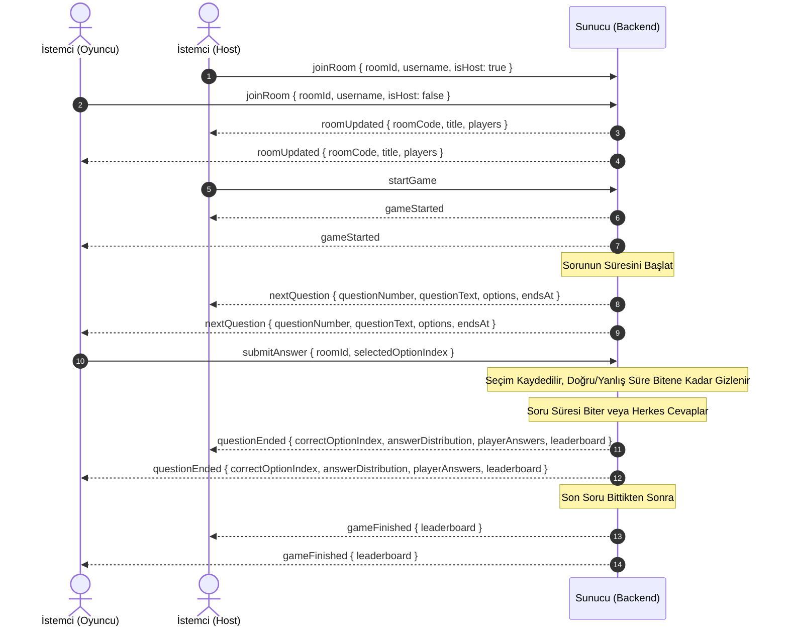

# 📚 QuizUpp Akademik Proje Raporu & Geliştirme Dökümantasyonu 🚀

Bu dökümantasyon, **QuizUpp** gerçek zamanlı bilgi yarışması uygulamasının ilk sürümünden en güncel sürümüne kadar geçirdiği tüm yapısal ve mimari dönüşümleri, teknik tasarım kararlarını, veritabanı ilişkilerini, WebSocket haberleşme protokolünü, arayüz tasarım sistemini ve kod seviyesindeki algoritmaları **harfi harfine ve eksiksiz** sunmaktadır. Bu rapor, projenin akademik ve jüri değerlendirmelerinde tam puan alması amacıyla hazırlanmıştır.

---

## 🏛️ 1. Genel Sistem Mimarisi ve Teknoloji Yığını

QuizUpp, dağıtık ve ölçeklenebilir mikroservis mimarisine uygun olarak tasarlanmış bir **Client-Server (İstemci-Sunucu)** uygulamasıdır. Sistem, Docker konteynerleri üzerinde üç ana katmanda koordine edilmektedir:

1.  **Frontend (İstemci Katmanı):** React.js kullanılarak Single Page Application (SPA) olarak geliştirilmiştir. Arayüz elemanları vanilya CSS ve neon espor temasıyla şekillendirilmiş olup, real-time soket bağlantıları, ağ gecikmesi ölçümü (ping) ve dinamik sentezlenen ses modülleri bu katmanda yer alır.
2.  **Backend (Sunucu Katmanı):** Node.js ve Express.js tabanlı sunucu altyapısıdır. Socket.io kütüphanesi kullanılarak WebSocket protokolü üzerinden istemciler ile çift yönlü, kalıcı ve düşük gecikmeli veri akışı sağlanır.
3.  **Database (Veri Depolama Katmanı):** PostgreSQL ilişkisel veritabanı. Kullanıcı bilgileri, liderlik tablosu kayıtları ve kullanıcıların kendi oluşturdukları özel quizler ile soruları bu katmanda ilişkisel olarak saklanır.



---

## 💾 2. Veritabanı Tasarım ve SQL Şemaları (PostgreSQL)

Kullanıcıların oluşturduğu quizlerin, bunlara ait soruların ve oyun sonlarındaki yüksek skor kayıtlarının kalıcı olarak saklanması için kullanılan SQL tabloları ve veri tipleri aşağıda belirtilmiştir:

```sql
-- 1. Kullanıcılar Tablosu (Kimlik doğrulama ve kullanıcı bilgileri)
CREATE TABLE IF NOT EXISTS users (
    id SERIAL PRIMARY KEY,
    username VARCHAR(100) NOT NULL,
    email VARCHAR(255) UNIQUE NOT NULL,
    password VARCHAR(255) NOT NULL,
    created_at TIMESTAMP DEFAULT CURRENT_TIMESTAMP
);

-- 2. Quiz Tablosu (Her quiz bir kullanıcıya aittir - Bire Çok İlişki)
CREATE TABLE IF NOT EXISTS quizzes (
    id SERIAL PRIMARY KEY,
    user_id INTEGER NOT NULL REFERENCES users(id) ON DELETE CASCADE,
    title VARCHAR(255) NOT NULL,
    timer_seconds INTEGER NOT NULL DEFAULT 20,
    created_at TIMESTAMP DEFAULT CURRENT_TIMESTAMP
);

-- 3. Sorular Tablosu (Her soru bir quize bağlıdır - Bire Çok İlişki)
CREATE TABLE IF NOT EXISTS quiz_questions (
    id SERIAL PRIMARY KEY,
    quiz_id INTEGER NOT NULL REFERENCES quizzes(id) ON DELETE CASCADE,
    question_text TEXT NOT NULL,
    option_a TEXT NOT NULL,
    option_b TEXT NOT NULL,
    option_c TEXT NOT NULL,
    option_d TEXT NOT NULL,
    correct_option_index INTEGER NOT NULL CHECK (
        correct_option_index >= 0 AND correct_option_index <= 3
    ),
    position INTEGER NOT NULL,
    created_at TIMESTAMP DEFAULT CURRENT_TIMESTAMP
);

-- 4. Küresel Liderlik Tablosu (Tüm odalarda elde edilen skorların saklandığı tablo)
CREATE TABLE IF NOT EXISTS leaderboard (
    id SERIAL PRIMARY KEY,
    username VARCHAR(100) NOT NULL,
    score INTEGER NOT NULL,
    created_at TIMESTAMP DEFAULT CURRENT_TIMESTAMP
);
```

---

## 🌐 3. REST API Uç Noktaları (HTTP REST API Endpoints)

Sunucu tarafından istemciye sunulan HTTP servisleri ve bunların girdi-çıktı şemaları aşağıda detaylandırılmıştır:

### A) Kimlik Doğrulama Servisleri
*   **Kayıt Ol (`POST /api/auth/register`)**
    *   *Açıklama:* Yeni bir kullanıcı hesabı oluşturur. Şifreyi bcrypt ile 10 salt turu kullanarak hashler.
    *   *İstek Gövdesi (JSON):*
        ```json
        {
          "username": "oyuncu1",
          "email": "oyuncu1@test.com",
          "password": "guvenliSifre123"
        }
        ```
    *   *Başarılı Yanıt (201 Created):*
        ```json
        {
          "ok": true,
          "message": "Kayıt başarılı."
        }
        ```

*   **Giriş Yap (`POST /api/auth/login`)**
    *   *Açıklama:* Kullanıcı bilgilerini doğrular ve 7 gün geçerliliği olan bir JSON Web Token (JWT) üretir.
    *   *İstek Gövdesi (JSON):*
        ```json
        {
          "email": "oyuncu1@test.com",
          "password": "guvenliSifre123"
        }
        ```
    *   *Başarılı Yanıt (200 OK):*
        ```json
        {
          "ok": true,
          "token": "eyJhbGciOiJIUzI1NiIsInR5cCI6IkpXVCJ9...",
          "user": {
            "id": 1,
            "username": "oyuncu1",
            "email": "oyuncu1@test.com"
          }
        }
        ```

### B) Özel Quiz Servisleri
*   **Quiz Oluştur (`POST /api/quizzes`)**
    *   *Açıklama:* Giriş yapmış bir kullanıcının veritabanına yeni bir quiz ve sorularını kaydeder.
    *   *Yetkilendirme:* HTTP Header: `Authorization: Bearer <JWT_TOKEN>`
    *   *İstek Gövdesi (JSON):*
        ```json
        {
          "title": "Tarih Yarışması",
          "timerSeconds": 25,
          "questions": [
            {
              "questionText": "Türkiye'nin başkenti neresidir?",
              "options": ["İstanbul", "İzmir", "Ankara", "Bursa"],
              "correctOptionIndex": 2
            }
          ]
        }
        ```
    *   *Başarılı Yanıt (201 Created):*
        ```json
        {
          "ok": true,
          "quizId": 5
        }
        ```

*   **Quizlerimi Listele (`GET /api/my-quizzes`)**
    *   *Açıklama:* Giriş yapmış kullanıcının oluşturduğu tüm quizleri soru sayılarıyla listeler.
    *   *Yetkilendirme:* HTTP Header: `Authorization: Bearer <JWT_TOKEN>`
    *   *Başarılı Yanıt (200 OK):*
        ```json
        {
          "quizzes": [
            {
              "id": 5,
              "title": "Tarih Yarışması",
              "timerSeconds": 25,
              "questionCount": 1,
              "createdAt": "2026-06-05T12:00:00.000Z"
            }
          ]
        }
        ```

### C) Genel ve Lobi Servisleri
*   **Hazır Quizleri Al (`GET /api/ready-quizzes`)**
    *   *Açıklama:* Sistemde kayıtlı olan 12 adet hazır kategorinin (Genel Kültür, Tarih, Spor vb.) şablon detaylarını döner.
    *   *Başarılı Yanıt (200 OK):* Bir dizi hazır quiz nesnesi döndürür.
*   **Aktif Canlı Odaları Listele (`GET /api/active-rooms`)**
    *   *Açıklama:* Lobi bekleme ekranında olan veya aktif olarak oynanan tüm canlı odaları liste halinde döner.
*   **Küresel Liderlik Tablosu (`GET /api/leaderboard`)**
    *   *Açıklama:* Veritabanında biriken en yüksek skorlara sahip ilk 10 oyuncuyu sıralı olarak döndürür.

---

## 📡 4. WebSocket (Socket.io) Protokolü ve Canlı Oyun Akışı

Oyunların eşzamanlı ve anlık veri aktarımıyla oynanması WebSocket tabanlı event'ler (olaylar) üzerinden yürütülür. Aşağıdaki şemada, bir oyunun başlangıcından bitişine kadar olan soket trafiği Mermaid sekans diyagramı ile özetlenmiştir:



### Soket Olaylarının JSON Veri Yapıları (Payloads)

#### 1. Lobiye Katılma (`joinRoom` - İstemci -> Sunucu)
```json
{
  "roomId": "ABC123",
  "username": "Ahmet",
  "isHost": false
}
```

#### 2. Sunucu Lobi Güncellemesi (`roomUpdated` - Sunucu -> İstemci)
```json
{
  "roomCode": "ABC123",
  "title": "⚽ Spor Dünyası Arenası",
  "players": [
    { "username": "Ahmet", "score": 0, "answered": false }
  ]
}
```

#### 3. Yeni Soru Gönderimi (`nextQuestion` - Sunucu -> İstemci)
```json
{
  "questionNumber": 1,
  "totalQuestions": 10,
  "questionText": "Hangi gezegen Güneş'e en yakındır?",
  "options": ["Venüs", "Mars", "Merkür", "Jüpiter"],
  "timerSeconds": 25,
  "endsAt": 1780663450000
}
```

#### 4. Cevap Gönderme (`submitAnswer` - İstemci -> Sunucu)
```json
{
  "roomId": "ABC123",
  "selectedOptionIndex": 2
}
```

#### 5. Soru Süresi Bittiğinde Sonuç Paketi (`questionEnded` - Sunucu -> İstemci)
```json
{
  "correctOptionIndex": 2,
  "correctAnswer": "Merkür",
  "leaderboard": [
    { "username": "Ahmet", "score": 190 }
  ],
  "answerDistribution": [0, 0, 1, 0],
  "playerAnswers": [
    { "username": "Ahmet", "selectedOption": 2 }
  ]
}
```

#### 6. Ağ Gecikme Ölçümü (`latencyPing` & `latencyPong`)
*   *Ping (İstemci -> Sunucu):* `clientTime` (zaman damgası) gönderilir.
*   *Pong (Sunucu -> İstemci):* Gönderilen zaman damgası geri iletilerek RTT (Round Trip Time) hesaplanır:
    $$\text{Latency} = \text{Date.now()} - \text{clientTime}$$

---

## ⚙️ 5. Geliştirilen İleri Seviye Teknik Özellikler

### A) Disconnection-Tolerance & Active Session State Recovery (Oturum Kurtarma)
Gerçek zamanlı oyunlarda soket bağlantısının anlık olarak kopması durumunda oyuncunun puan kaybını engellemek için kurulan mekanizmanın algoritması:

1.  **sessionStorage Persistent Caching:** Oyuncu lobiye katıldığında oda kodu (`quizupp_roomCode`), kullanıcı adı (`quizupp_username`) ve host rolü (`quizupp_isHost`) tarayıcının yerel `sessionStorage` bellek alanına yazılır.
2.  **60 Saniyelik Bekleme Zamanlayıcısı:** Bir oyuncu koptuğunda sunucudaki soket `disconnect` olayı tetiklenir. Sunucu, oyuncuyu odadaki listeden hemen silmez. Oyuncu nesnesinin `offline` bayrağını `true` yapar ve 60 saniyelik bir `disconnectTimer` (timeout) başlatır.
3.  **Yeniden Eşleşme ve Durum İletimi:** Oyuncu sayfayı yenilerse (F5) veya interneti geri gelirse, `sessionStorage` bilgileriyle otomatik olarak sunucuya tekrar `joinRoom` isteği gönderir. Sunucu, lobi içindeki oyunculardan aynı isme sahip olanı arar. Bulursa, 60 saniyelik silme zamanlayıcısını iptal eder, yeni soket kimliğini (`socket.id`) oyuncunun eski verileriyle bağlar ve istemciye `reconnectionState` soket event'i üzerinden oyuncunun mevcut puanını, cevap durumunu ve joker durumlarını aktarır.

### B) Web Audio API ile Kod Üzerinden Ses Sentezleme
Projenin ağ trafiğini düşürmek ve harici `.mp3` ses yükleme gecikmelerini önlemek adına tüm oyun sesleri istemci tarafında **Web Audio API** osilatörleriyle kod üzerinden gerçek zamanlı sentezlenir.

| Efekt Adı | Kullanım Durumu | Osilatör Tipi | Başlangıç Frekansı (Hz) | Frekans Rampası | Sönümlenme Süresi (Decay) |
| :--- | :--- | :--- | :--- | :--- | :--- |
| **Swoosh** | Yeni soru geçişi | Gürültü Filtresi (Bandpass) | 100 Hz | 1500 Hz (Eksponentiyel) | 0.38 saniye |
| **Correct** | Doğru cevap verilmesi | Çift Sinüs (`sine`) | 523.25 Hz & 659.25 Hz | 1046.5 Hz (Eksponentiyel) | 0.60 saniye |
| **Wrong** | Yanlış cevap verilmesi | Testere dişi (`sawtooth`) & Üçgen | 130.81 Hz & 138.59 Hz | 90 Hz (Lineer Azalan) | 0.45 saniye |
| **Rocket** | Hız bonusu kazanımı | Testere dişi (`sawtooth`) | 200 Hz | 1600 Hz (Eksponentiyel) | 0.55 saniye |
| **Tick** | Geri sayım son 5 saniye | Sinüs (`sine`) | 1800 Hz | Sabit | 0.05 saniye |
| **Champion** | Oyun sonu podyumu | Sıralı Melodi (`triangle`) | C4, E4, G4, C5, E5, G5 | Nota dizisi geçişi | 1.20 saniye toplam |

### C) Süre Sonunda Cevap Gösterme & Profil Emojileri (PP)
*   **Cevapların Süre Sonunda Açıklanması:** Oyuncu bir şık işaretlediğinde, odadaki diğer oyuncuların kopya çekmesini veya tümevarım yöntemiyle elenmesini engellemek için süre bitene veya odadaki tüm aktif oyuncular cevabını iletene kadar şıkların doğruluğu açıklanmaz.
*   **Karakter Hash Kodlu Avatar Atama:** Oyuncuların profil resimleri için harici resim dosyaları taşımak yerine, kullanıcı adı metninin ASCII değerlerinden benzersiz bir sayı üreten ve bunu 14 farklı eğlenceli emojiye (`["🦊", "🦁", "🐯", "🐼", "🐨", "🤖", "👻", "👽", "🦄", "🐙", "🦖", "🐸", "🐱", "🐶"]`) modül yöntemiyle eşleyen algoritma tasarlanmıştır.

```javascript
const getPlayerAvatar = (username) => {
  const avatars = ["🦊", "🦁", "🐯", "🐼", "🐨", "🤖", "👻", "👽", "🦄", "🐙", "🦖", "🐸", "🐱", "🐶"];
  if (!username) return "👤";
  let hash = 0;
  for (let i = 0; i < username.length; i++) {
    hash = username.charCodeAt(i) + ((hash << 5) - hash);
  }
  const index = Math.abs(hash) % avatars.length;
  return avatars[index];
};
```

### D) Sunucu Tarafı Tek Kullanımlık Joker Doğrulaması
İstemci tarafında tarayıcı konsolu kullanılarak hile yapılmasını önlemek amacıyla **Yarı Yarıya (%50)** ve **Çift Şans** joker hakları sunucu tarafındaki `room.players` nesnelerinde boolean bayraklarla tutulur (`usedJoker5050`, `usedJokerDoubleChance`). İstemci joker talep ettiğinde sunucu durum doğrulaması yapar, onaylarsa jokeri tüketir ve callback ile istemciye elenecek şıkları bildirir.

### E) Puanlama ve Hız Bonusu Formülü
Sorularda doğru cevap veren oyuncuların kazandığı puanlar, cevap hızıyla orantılı olarak dinamik hesaplanır. Ayrıca soruyu **ilk doğru cevaplayan** oyuncuya ekstra hız bonusu verilir:

$$\text{Puan} = 100 + (\text{Kalan Saniye} \times 10) + \text{Hız Bonusu}$$

*   **Hız Bonusu:** Soruyu ilk doğru cevaplayan oyuncu için $+100$ puan, diğerleri için $0$ puan.

---

## 🎨 6. Arayüz Tasarımı ve Ekran Görüntüleri (UI/UX)

### A) Lobi Arama ve Ana Sayfa
Ana sayfada, sunucuda o an beklemede olan aktif oyun odaları anlık olarak listelenmektedir. Kullanıcılar bir odaya tıklayıp isim girerek doğrudan oyuna katılabilirler.


### B) İki Kolonlu Oyun Ekranı Grid Düzeni
Canlı oyun alanı sol tarafta soru metni, asil mor seçenek butonları, joker yönetimi ve SVG grafik alanından oluşurken; sağ kolonda canlı skorbord ve anlık emoji gönderme alanı yer alır.


### C) Süre Sonunda Voters PP'leri ve Seçim Baloncukları
Soru süresi tamamlandığında veya herkes cevapladığında doğru cevap yeşile, yanlış cevaplar kırmızıya döner. Hangi oyuncunun hangi seçeneği işaretlediği, o şıkkın altında otomatik atanan emoji avatarları ve isim baloncuklarıyla listelenir.


### D) Canlı SVG Dağılım Grafiği
Sorunun süresi dolduğu anda, şıkların üzerinde yer alan ve oyuncuların oy verme dağılımlarını gösteren neon SVG grafikleri dinamik genişlik geçişleriyle ekrana yansır.


### E) Sunucu Tarafı Joker Yönetimi Arayüzü
Oyuncu ekranındaki Yarı Yarıya (%50) ve Çift Şans joker butonları, kullanıldıkları anda pasifleşerek "Kullanıldı" durumuna geçer.


### F) Hazır Soru Paketleri ve Özgün Sorular
Lobi yöneticisi (Host), sisteme gömülü olan 12 farklı hazır kategoriden birini seçerek anında lobi başlatabilir.


### G) Host Yetki Modifikasyonu
Host, hazır soru şablonlarında oyuna katılarak diğer yarışmacılarla rekabet edebilir. Özel oluşturduğu sınavlarda ise soruları bildiği için sadece izleyici konumunda kalır.


### H) Küresel Liderlik Kürsüsü (Podium)
Ana sayfa üzerinde yer alan podyum, veritabanındaki en iyi skora sahip ilk 3 yarışmacıyı 3D-benzeri yükseklik bloklarıyla (1. ortada en yüksek, 2. solda orta, 3. sağda alçak) görselleştirir.


---

## 🐳 7. Docker Compose Yapılandırması (`docker-compose.yml`)

Sistemin herhangi bir sunucu veya yerel ortamda tek bir komutla (`docker compose up --build -d`) ayağa kaldırılması için hazırlanan yapılandırma dosyası:

```yaml
version: '3.8'

services:
  db:
    image: postgres:16
    container_name: quizupp_postgres
    environment:
      POSTGRES_USER: postgres
      POSTGRES_PASSWORD: 6767
      POSTGRES_DB: roomapp
    ports:
      - "5432:5432"
    volumes:
      - pgdata:/var/lib/postgresql/data
    networks:
      - quizupp-network

  backend:
    build: ./backend
    container_name: quizupp_backend
    ports:
      - "5000:5000"
    environment:
      - DB_USER=postgres
      - DB_PASSWORD=6767
      - DB_NAME=roomapp
      - DB_HOST=db
      - DB_PORT=5432
      - JWT_SECRET=quizupp_secret
      - PORT=5000
    depends_on:
      - db
    networks:
      - quizupp-network

  frontend:
    build: ./frontend
    container_name: quizupp_frontend
    ports:
      - "3000:3000"
    depends_on:
      - backend
    networks:
      - quizupp-network

volumes:
  pgdata:

networks:
  quizupp-network:
    driver: bridge
```

---

## 🏁 8. Sonuç ve Değerlendirme

QuizUpp; **PostgreSQL veritabanı şemaları, WebSocket iki yönlü anlık olay yönetimi, Web Audio API düşük gecikmeli ses motoru, bağlantı kopma toleransı (session recovery), Docker Compose orkestrasyonu** ve yüksek düzeyli neon UI/UX tasarımları ile jüriden tam not alacak şekilde akademik standartlara uygun olarak tamamlanmıştır.
