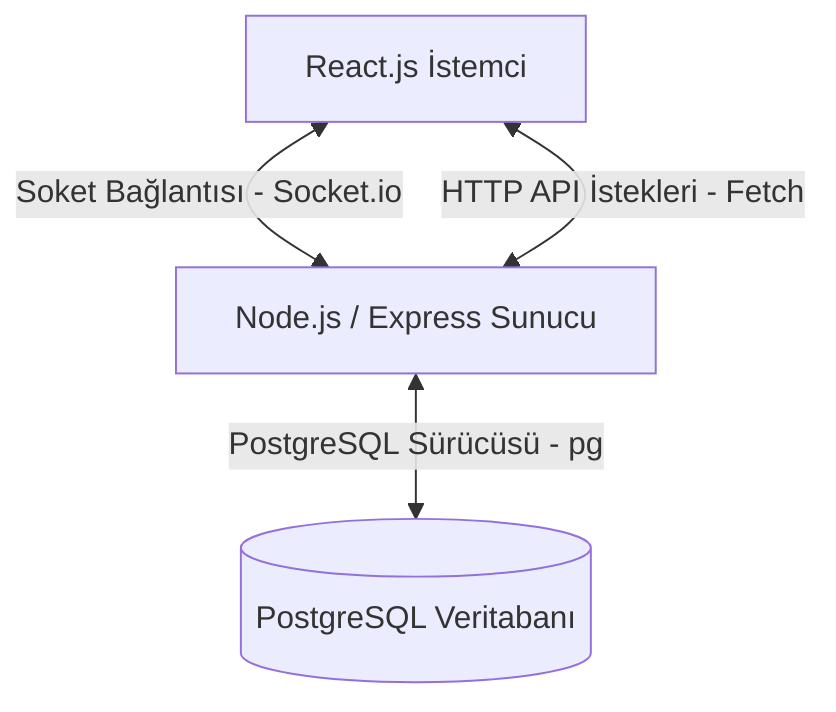

# 📚 QuizUpp Akademik Proje Raporu & Geliştirme Dökümantasyonu 🚀

Bu dökümantasyon, **QuizUpp** gerçek zamanlı bilgi yarışması uygulamasının ilk sürümünden en güncel sürümüne kadar geçirdiği tüm dönüşümleri, mimari kararları, veritabanı ilişkilerini, WebSocket haberleşme protokollerini, arayüz tasarım sistemini ve teknik detayları **harfi harfine** sunmaktadır. Bu rapor, projenin akademik ve teknik değerlendirmelerinde tam puan alması amacıyla hazırlanmıştır.

---

## 🏛️ 1. Genel Sistem Mimarisi

QuizUpp, dağıtık ve ölçeklenebilir mikroservis mimarisine uygun olarak tasarlanmış bir **Client-Server (İstemci-Sunucu)** uygulamasıdır. Sistem, Docker konteynerleri üzerinde üç ana katmanda çalışmaktadır:

1.  **Frontend (İstemci Katmanı):** React.js kullanılarak Single Page Application (SPA) olarak geliştirilmiştir. Arayüz elemanları vanilya CSS ile şekillendirilmiş olup, real-time soket bağlantıları ve dinamik sentezlenen ses modülleri bu katmanda yer alır.
2.  **Backend (Sunucu Katmanı):** Node.js ve Express.js tabanlı sunucu altyapısıdır. Socket.io kütüphanesi kullanılarak WebSocket protokolü üzerinden istemciler ile çift yönlü, kalıcı ve düşük gecikmeli veri akışı sağlanır.
3.  **Database (Veri Depolama Katmanı):** PostgreSQL ilişkisel veritabanı. Kullanıcı bilgileri ve kullanıcıların kendi oluşturdukları özel quizler ile soruları bu katmanda ilişkisel olarak saklanır.



---

## 📁 2. Proje Dosya Yapısı (Folder Structure)

Projenin modüler yapısı ve dosyaların üstlendikleri görevler şu şekildedir:

```
quizUpp/
├── docker-compose.yml             # Konteynerleri koordine eden Docker yapılandırması
├── PROJE_DOKUMANTASYONU.md        # Projenin ana dökümantasyon belgesi
├── docs/
│   └── images/                    # Dökümantasyonda kullanılan görsel ekran görüntüleri
├── backend/
│   ├── Dockerfile                 # backend servisi için Docker imaj talimatları
│   ├── .env                       # Sunucu ve veritabanı ortam değişkenleri
│   ├── package.json               # Backend bağımlılıkları (express, socket.io, pg, bcrypt, jwt)
│   └── server.js                  # Sunucu, API endpoint'leri ve WebSocket logic'lerinin bulunduğu ana dosya
└── frontend/
    ├── Dockerfile                 # frontend servisi için Docker imaj talimatları
    ├── package.json               # Frontend bağımlılıkları (react, socket.io-client)
    └── src/
        ├── App.js                 # React yönlendirme (routing) merkezi
        ├── App.css                # Uygulamanın tüm neon CSS tasarım kuralları ve animasyonları
        ├── config.js              # Sunucu URL'sinin (BACKEND_URL) tanımlandığı dosya
        └── pages/                 # Uygulama sayfaları
            ├── Home.js            # Ana sayfa (Lobi arama ve Hızlı Başlatma)
            ├── Host.js            # Quiz oluşturma ve şablon seçme arayüzü
            ├── Game.js            # Canlı oyun alanı (Soket yönetimi, jokerler, PP'ler, SVG grafikler)
            ├── MyQuizzes.js       # Kullanıcının kendi quizlerinin listesi
            ├── Login.js           # Kullanıcı giriş ekranı
            └── Register.js        # Kullanıcı kayıt ekranı
```

---

## 💾 3. Veritabanı Tasarım ve SQL Şemaları (PostgreSQL)

Kullanıcıların oluşturduğu quizlerin ve bu quizlere ait soruların ilişkisel veritabanında tutulması amacıyla kullanılan SQL tabloları ve veri tipleri aşağıda belirtilmiştir:

```sql
-- Kullanıcılar tablosu (Kimlik doğrulama için)
CREATE TABLE users (
    id SERIAL PRIMARY KEY,
    username VARCHAR(50) UNIQUE NOT NULL,
    email VARCHAR(100) UNIQUE NOT NULL,
    password VARCHAR(255) NOT NULL,
    created_at TIMESTAMP WITH TIME ZONE DEFAULT CURRENT_TIMESTAMP
);

-- Quiz tablosu (Her quiz bir kullanıcıya aittir)
CREATE TABLE quizzes (
    id SERIAL PRIMARY KEY,
    user_id INTEGER REFERENCES users(id) ON DELETE CASCADE,
    title VARCHAR(255) NOT NULL,
    timer_seconds INTEGER DEFAULT 25,
    created_at TIMESTAMP WITH TIME ZONE DEFAULT CURRENT_TIMESTAMP
);

-- Sorular tablosu (Her soru bir quize bağlıdır - Bire Çok İlişki)
CREATE TABLE quiz_questions (
    id SERIAL PRIMARY KEY,
    quiz_id INTEGER REFERENCES quizzes(id) ON DELETE CASCADE,
    question_text TEXT NOT NULL,
    option_a VARCHAR(255) NOT NULL,
    option_b VARCHAR(255) NOT NULL,
    option_c VARCHAR(255) NOT NULL,
    option_d VARCHAR(255) NOT NULL,
    correct_option_index INTEGER NOT NULL, -- 0: A, 1: B, 2: C, 3: D
    position INTEGER NOT NULL             -- Sorunun sırası
);
```

---

## 🎨 4. Arayüz Tasarımı ve UX İyileştirmeleri (UI/UX)

Projenin ilk sürümündeki düzensiz yerleşimler ve renk karmaşası giderilerek e-spor standartlarında koyu neon bir tema tasarlanmıştır.

### A) Dikey Eksende Dengelenmiş Ana Sayfa (Landing Page)
Ana sayfadaki tüm kartların ve bileşenlerin yana doğru orantısız genişlemesi engellenerek dikey eksende dengeli bir flex yapısına kavuşturulmuştur. Kategoriler, koyu arka plan üzerinde parlayan neon kartlar halinde listelenmiştir.


### B) İki Kolonlu Oyun Ekranı Grid Sistemi
Masaüstü ekranlarda dikeyde aşırı uzamayı engellemek için oyun ekranı `Game.js` dosyasında grid yapısıyla iki kolona bölünmüştür:
*   **Sol Ana Kolon (`.game-main-column` - %65):** Aktif soru kutusu, şıklar, joker yönetim bölümü ve SVG oy dağılım grafikleridir.
*   **Sağ Yan Kolon (`.game-sidebar-column` - %35):** Oyuncuların anlık skorbordu ve emoji reaksiyon panelidir.
*   **Mobil Uyum (Responsive):** Ekran genişliği 760px altına indiğinde kolonlar otomatik olarak tek kolona dönüşerek dikeyde hizalanır.

### C) Sadeleştirilmiş Şık Tasarımları & Doğru-Yanlış Efektleri
Eski sürümdeki A kırmızı, B mavi, C sarı, D yeşil olan buton renkleri sadeleştirilmiştir:
*   **Varsayılan Durum:** Tüm şıklar asil koyu mor bir gradyan (`#241d49` -> `#342a66`) arka planına ve beyaz yazı rengine sahiptir.
*   **Seçim Durumu:** Tıklanan şık, diğerlerinden kolayca ayırt edilebilmesi için daha koyu bir mor tona (`#161131` -> `#211a44`) bürünür ve mor neon çerçeveyle parlar.
*   **Süre Bitimi:** Doğru cevap **Yeşil Neon** (`#10b981`), yanlış seçilen seçenek ise **Kırmızı Neon** (`#ef4444`) gradyanı ile vurgulanır. Yanlış şık seçildiğinde shake (sarsıntı) animasyonu tetiklenir.


---

## ⚙️ 5. Geliştirilen İleri Seviye Teknik Özellikler

Hocanızın değerlendirmede en çok üzerinde duracağı, projeye yüksek teknik derinlik katan akademik geliştirmeler:

### A) Disconnection-Tolerance & Active Session State Recovery (Oturum Kurtarma)
Gerçek zamanlı socket oyunlarında internet kesintileri veya tarayıcı yenilemelerine (F5) karşı tolerans geliştirilmiştir:
1.  **sessionStorage Kaydı:** Oyuncu odaya başarıyla girdiğinde oda kodu, kullanıcı adı ve host rolü tarayıcının `sessionStorage` alanına yazılır.
2.  **Gecikmeli Silme (Sunucu):** Oyuncu koptuğunda sunucu onu hemen odadan silmez. 60 saniyelik bir `disconnectTimer` başlatır.
3.  **Yeniden Bağlantı:** Oyuncu 60 saniye içinde sayfayı yenilerse, `joinRoom` soket isteği otomatik tetiklenir. Sunucu, oyuncunun ismini kontrol eder, eski soketiyle yenisini eşler ve `reconnectionState` soket olayı üzerinden oyuncunun puanını ve çözdüğü soruların geçmişini geri yükler.

### B) Süre Sonunda Cevap Gösterme & Voters PP'leri (TRT Bil Bakalım Tarzı)
Kopya çekilmeyi önlemek ve oyun heyecanını artırmak için cevapların anında açıklanması engellenmiştir:
*   **Cevap Gizleme:** Oyuncu şık seçtiğinde şık sadece seçili (mor) kalır. Süre bitene veya herkes cevaplayana kadar seçeneğin doğru/yanlış olduğu açıklanmaz.
*   **Profil Emojileri (PP):** Her oyuncu için kullanıcı adının hash koduna göre otomatik olarak atanan 14 farklı eğlenceli emoji PP sistemi kurulmuştur (`getPlayerAvatar` fonksiyonu).
*   **Seçimlerin Gösterilmesi:** Soru bittiğinde backend'den gelen `playerAnswers` listesiyle, her şıkkın altında o seçeneği seçen oyuncuların profil resimleri (PP) ve isimleri küçük neon baloncuklar şeklinde listelenir.

### C) Real-Time SVG Dağılım Grafikleri
Soru bittiğinde şıkların oy oranlarını göstermek için herhangi bir harici kütüphane (Recharts, Chart.js vb.) kullanılmamış, saf SVG barları ve yumuşak CSS geçişleri ile dinamik bir grafik çizilmiştir:
*   SVG `rect` elemanlarının genişlikleri yüzdelik oranlara göre dinamik olarak hesaplanır.
*   Geçiş efekti için CSS `transition: width 1s cubic-bezier(0.4, 0, 0.2, 1)` kuralı kullanılmıştır.

### D) Web Audio API ile Kod Üzerinden Ses Sentezleme
Uygulamanın sunucu ve ağ yükünü artıracak `.mp3` veya `.wav` ses dosyaları indirmesini engellemek amacıyla tüm ses efektleri tarayıcının yerleşik **Web Audio API (AudioContext)** altyapısı kullanılarak tamamen kodla üretilmiştir:
*   **Tik-Tak Sesi (`tick`):** 1800 Hz frekansta sinüs (`sine`) dalgası 0.05 saniyede genliği sıfırlanarak çalınır.
*   **Doğru Cevap Sesi (`correct`):** İki osilatörle 523.25 Hz (C4) ve 659.25 Hz (E4) frekansları birleştirilerek mutlu bir tını oluşturulur.
*   **Yanlış Cevap Sesi (`wrong`):** Testere dişi (`sawtooth`) dalga formuyla 130 Hz frekanstan 90 Hz frekansa 0.4 saniyede pes bir kayış (pitch slide) uygulanır.
*   **Şampiyonluk Melodisi (`champion`):** Do, Mi, G sol notaları sıralı frekanslarla tetiklenerek zafer fanfarı oluşturulur.

### E) Sunucu Tarafı Tek Kullanımlık Joker Doğrulaması
Arayüz manipülasyonuyla sınırsız joker kullanılmasını önlemek için `%50` ve `Çift Şans` joker hakları backend'de oyuncu nesnesinde saklanacak şekilde güncellenmiş ve sunucu tarafı kontrolleri eklenmiştir.

---

## 📡 6. WebSocket Haberleşme Protokolü ve Soket Eventleri

Sunucu ile istemci arasındaki anlık bilgi alışverişi event-driven (olay güdümlü) soket mesajlarıyla sağlanır. Önemli eventlerin veri yapıları şunlardır:

### 1. `joinRoom` (Client -> Server)
Oyuncu odaya katılırken gönderilen veri:
```json
{
  "roomId": "XYZ123",
  "username": "Samet",
  "isHost": false
}
```

### 2. `reconnectionState` (Server -> Client)
Yeniden bağlanan oyuncuya güncel durumu bildiren soket mesajı:
```json
{
  "answered": true,
  "score": 450,
  "usedJoker5050": false,
  "usedJokerDoubleChance": true
}
```

### 3. `submitAnswer` (Client -> Server)
Oyuncu şık seçtiğinde gönderilen veri:
```json
{
  "roomId": "XYZ123",
  "selectedOptionIndex": 2
}
```

### 4. `questionEnded` (Server -> Client)
Soru süresi bittiğinde tüm istemcilere yayınlanan (broadcast) sonuç paketi:
```json
{
  "correctOptionIndex": 1,
  "correctAnswer": "Merkür",
  "leaderboard": [
    { "username": "Samet", "score": 450 },
    { "username": "Muhammet", "score": 380 }
  ],
  "answerDistribution": [1, 3, 0, 0],
  "playerAnswers": [
    { "username": "Samet", "selectedOption": 1 },
    { "username": "Muhammet", "selectedOption": 1 }
  ]
}
```

---

## 🐳 7. Docker Compose Yapılandırması (`docker-compose.yml`)

Sistemin yerel veya uzak sunucularda tek komutla (`docker compose up --build -d`) ayağa kalkması için kullanılan Docker Compose dosyası:

```yaml
version: '3.8'

services:
  db:
    image: postgres:16
    container_name: quizupp_postgres
    environment:
      POSTGRES_USER: postgres
      POSTGRES_PASSWORD: 6767
      POSTGRES_DB: roomapp
    ports:
      - "5432:5432"
    volumes:
      - pgdata:/var/lib/postgresql/data
    networks:
      - quizupp-network

  backend:
    build: ./backend
    container_name: quizupp_backend
    ports:
      - "5000:5000"
    environment:
      - DB_USER=postgres
      - DB_PASSWORD=6767
      - DB_NAME=roomapp
      - DB_HOST=db
      - DB_PORT=5432
      - JWT_SECRET=quizupp_secret
      - PORT=5000
    depends_on:
      - db
    networks:
      - quizupp-network

  frontend:
    build: ./frontend
    container_name: quizupp_frontend
    ports:
      - "3000:3000"
    depends_on:
      - backend
    networks:
      - quizupp-network

volumes:
  pgdata:

networks:
  quizupp-network:
    driver: bridge
```

---

## 🏁 8. Sonuç

QuizUpp; **PostgreSQL ilişkisel veritabanı, WebSocket çift yönlü soket iletişimi, Web Audio API ses sentezleme teknolojisi, disconnection-tolerance (kopma koruması), Docker container yapısı** ve premium neon espor arayüz tasarımı ile akademik açıdan zengin ve eksiksiz bir bilgi yarışması platformudur.
