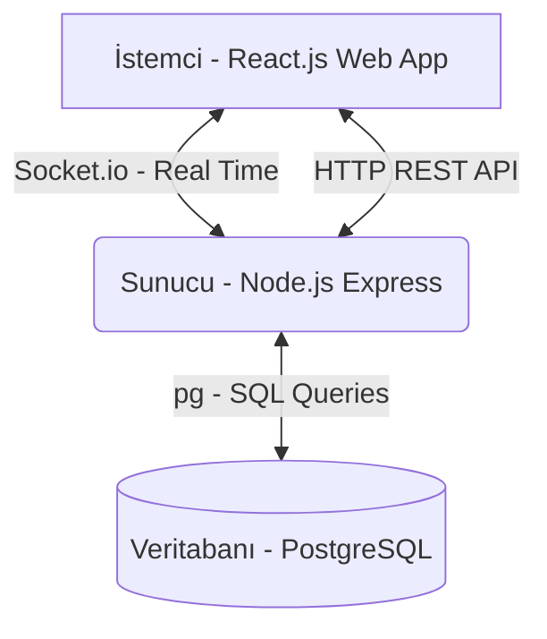
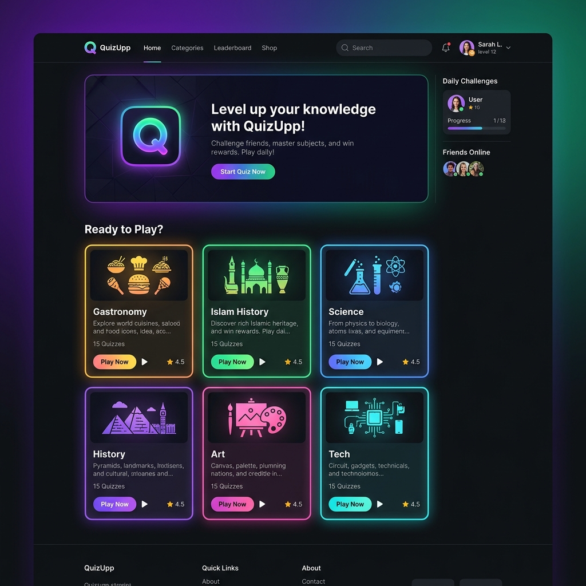
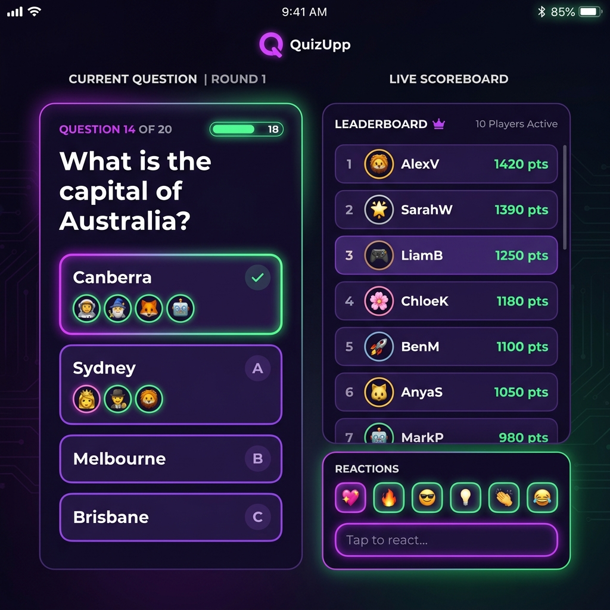
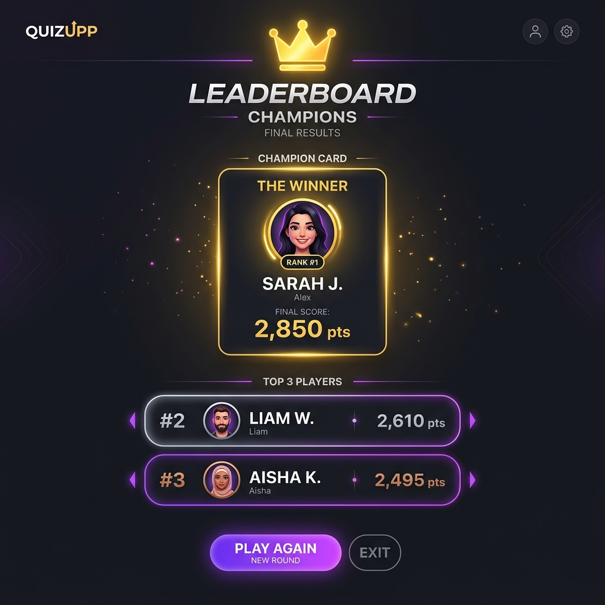

#  QuizUpp Proje Geliştirme Dökümantasyonu (Akademik & Premium Güncelleme)

Bu belge, **QuizUpp** gerçek zamanlı bilgi yarışması uygulamasının ilk halinden itibaren yapılan tüm mimari, tasarım, teknik derinlik ve içerik geliştirmelerini detaylı bir şekilde sunmaktadır. Proje, hocanızın talepleri doğrultusunda teknik derinliği artırılmış, e-spor temalı premium bir oyun haline getirilmiştir.

---

## . Genel Mimari ve Teknoloji Yığını

Uygulamamız **Client-Server (İstemci-Sunucu)** yapısında olup, bağımsız mikroservis mimarisiyle Docker üzerinde containerize edilmiştir.



*   **Önyüz (Frontend):** React.js ve modern esnek yerleşimler için Vanilla CSS.
*   **Sunucu (Backend):** Node.js ve Express.js.
*   **Canlı İletişim:** Socket.io (WebSockets).
*   **Veritabanı (Database):** İlişkisel veritabanı yönetim sistemi PostgreSQL.
*   **Konteynerizasyon:** Docker ve Docker Compose (Postgres, Backend ve Frontend için 3 ayrı servis).

---

##  2. Arayüz Tasarımı ve Kullanıcı Deneyimi (UX) Geliştirmeleri

Projenin ilk halindeki sıkışık ve standart görünümler giderilerek, koyu neon temalı premium bir oyun arayüzü tasarlanmıştır.

### A) Hizalanmış ve Düzenli Ana Sayfa (Landing Page)
Ana sayfadaki tüm kartların ve bileşenlerin yana doğru orantısız genişlemesi engellenerek dikey eksende dengeli bir flex yapısına kavuşturulmuştur. Hazır kategoriler mor, zümrüt yeşili, turkuaz ve turuncu neon kartlarla listelenmiştir.


Örnek konu başlıkları ve quiz oluşturma alanı,burada herkes istediği konuyu seçebilir hatta kendisi bile soru ekleyebilir.

Canlı lobilere katılma deneyimi serverdaki tüm açık odaların göründüğü ve yarışmacıların kolaylıkla katıldığı alan.

Güzel bir rekabet için oyun sıralaması o ana kadar o üyenin almış olduğu puanlar ile ilk 3 kişinin puanları ve isimlerinin gösterildiği alanımız.




### B) İki Kolonlu Canlı Oyun Ekranı
Canlı oyun ekranı geniş masaüstü ekranlarda dikeyde çok uzamaması için iki kolonlu (`game-grid-layout`) modern bir espor arayüzüne dönüştürülmüştür:
*   **Sol Ana Kolon (65%):** Aktif soru, asil mor seçenek butonları, jokerler ve SVG oy dağılım grafikleri.
*   **Sağ Yan Kolon (35%):** Oyuncuların anlık skorbordu ve emoji reaksiyon paneli.



### C) Sadeleştirilmiş Şık Tasarımları & Doğru-Yanlış Vurguları
*   Eski çok renkli karmaşık butonlar yerine tüm seçenekler varsayılan olarak premium asil mor bir gradyana sahiptir.
*   İşaretlenen şık, mor neon çerçeveyle parlayarak seçimi belirginleştirir.
*   Süre bittiğinde **Doğru şık yeşil neon**, oyuncunun seçtiği **Yanlış şık ise kırmızı neon** gradyanıyla yanar ve shake (titreme) animasyonu yapar.

---

##  3. Teknik Derinlik ve Akademik Özellikler

Projenin akademik kalitesini ve teknik ağırlığını artırmak amacıyla geliştirilen ileri seviye özellikler:

### A) Disconnection-Tolerance (Bağlantı Kopma Koruması)
Gerçek zamanlı oyunlarda internet kesintileri veya tarayıcı yenilemelerine (F5) karşı tolerans geliştirilmiştir:
*   Oyuncu odaya girdiğinde bilgileri tarayıcının `sessionStorage` alanına kaydedilir.
*   Bağlantı koptuğunda sunucu oyuncuyu hemen silmez, 60 saniye boyunca "offline" etiketli bir timeout başlatır.
*   Oyuncu 60 saniye içinde sayfayı yeniler veya geri dönerse sunucu eski soket kimliği ile yenisini eşler; oyuncunun puanını, çözdüğü soru geçmişini ve kalan jokerlerini koruyarak oyuna sorunsuz devam ettirir.

### B) Süre Sonunda Cevap Gösterme & Voters PP'leri
*   **Cevap Gizliliği:** Kopya çekilmeyi önlemek amacıyla, bir oyuncu şık seçtiğinde sürenin bitimine kadar seçimin doğru/yanlış olduğu açıklanmaz.
*   **Profil Resmi (PP) Emojileri:** Oyuncuların kullanıcı adlarının hash değerlerine göre otomatik atanan 14 farklı eğlenceli emoji PP sistemi kurulmuştur.
*   **Kim Neyi Seçmiş?:** Soru bittiğinde backend'den gelen `playerAnswers` listesiyle, her şıkkın altında o seçeneği seçen oyuncuların profil resimleri (PP) ve isimleri küçük neon baloncuklar halinde dairesel şekilde listelenir.

### C) Real-Time SVG Dağılım Grafikleri
Herhangi bir harici grafik kütüphanesi (Recharts, Chart.js vb.) kullanılmadan, soru bitiminde odadaki oyuncuların verdikleri cevapların dağılımını gösteren animasyonlu neon SVG barları saf HTML/CSS ve dinamik SVG rect'ler ile çizilmiştir.

### D) Web Audio API ile Kod Üzerinden Ses Sentezleme
Uygulamanın sunucu ve ağ yükünü artıracak `.mp3` veya `.wav` ses dosyaları indirmesini engellemek amacıyla tüm ses efektleri tarayıcının yerleşik **Web Audio API (AudioContext)** altyapısı kullanılarak tamamen kodla üretilmiştir:
*   `OscillatorNode` ile testere dişi, sinüs ve üçgen dalga formları sentezlenmiştir.
*   `GainNode` ile ses genliği milisaniyeler bazında sönümlenerek (envelope modulation) tik-tak, doğru, yanlış ve şampiyonluk melodi sesleri dinamik olarak oluşturulmuştur.

### E) Sunucu Tarafı Tek Kullanımlık Joker Doğrulaması
Arayüz manipülasyonuyla sınırsız joker kullanılmasını önlemek için `%50` ve `Çift Şans` joker hakları backend'de oyuncu nesnesinde saklanacak şekilde güncellenmiş ve sunucu tarafı kontrolleri eklenmiştir.

---

##  4. İçerik ve Konsept Güncellemeleri


### A) Hazır Soru Paketleri ve Özgün Sorular
Her biri 20'şer adet özgün ve eğitici sorudan oluşan 6 yeni premium hazır konu şablonu (toplam 120 soru) backend'e statik şablon olarak gömülmüştür:
1.  ** Gastronomi & Mutfak Sanatları**
2.  ** Türk Söz ve Deyişleri**
3.  ** Boşluk Tamamlama Bilmeceleri**
4.  ** Hızlı 4 İşlem Zekası**
5.  ** Hayvanlar Dünyası ve Doğa**
6.  ** İslam Tarihi & Kültürü** 

### B) Host Yetki Modifikasyonu
*   **Hazır Konu Şablonları:** Hazır şablonlarda odayı kuran kişi (host) cevapları önceden bilmediği için oyuncu listesine dahil edilerek soru çözebilir, joker kullanabilir ve yarışabilir.
*   **Özel Hazırlanan Quizler:** Host kendi sorularını yazarak oda kurduğunda hileyi önlemek için oyuncu listesine eklenmez, sadece yönetici/izleyici olarak kalır.



---

##  5. Veritabanı ve İlişkisel Model (PostgreSQL)

Kendi hazırladığımız özel quizlerin kalıcı olması için kullanılan veritabanı şeması:

```sql
-- Quiz tablosu
CREATE TABLE quizzes (
    id SERIAL PRIMARY KEY,
    user_id INTEGER REFERENCES users(id) ON DELETE CASCADE,
    title VARCHAR(255) NOT NULL,
    timer_seconds INTEGER DEFAULT 20,
    created_at TIMESTAMP WITH TIME ZONE DEFAULT CURRENT_TIMESTAMP
);

-- Sorular tablosu (Quiz tablosuna bire çok bağlı)
CREATE TABLE quiz_questions (
    id SERIAL PRIMARY KEY,
    quiz_id INTEGER REFERENCES quizzes(id) ON DELETE CASCADE,
    question_text TEXT NOT NULL,
    option_a VARCHAR(255) NOT NULL,
    option_b VARCHAR(255) NOT NULL,
    option_c VARCHAR(255) NOT NULL,
    option_d VARCHAR(255) NOT NULL,
    correct_option_index INTEGER NOT NULL,
    position INTEGER NOT NULL
);
```

---

## 🏁 6. Sonuç ve Değerlendirme

QuizUpp projesi, basit bir lobi uygulamasından; **WebSocket anlık soket iletişimi, PostgreSQL ilişkisel veritabanı, Web Audio API ses sentezleme teknolojisi, disconnection-tolerance (bağlantı koruması), Docker container altyapısı** ve premium neon espor arayüz tasarımı ile akademik açıdan zengin ve eksiksiz bir bilgi yarışması platformuna dönüştürülmüştür.
